# Architecture: `cds-feature-ai-core`

## Table of Contents

- [Purpose](#purpose)
- [Dependencies](#dependencies)
- [Feature](#feature)
  - [CDS Model](#cds-model)
  - [Public API](#public-api)
  - [Key Infrastructure Classes](#key-infrastructure-classes)
  - [Multi-Tenancy](#multi-tenancy)
  - [Key Flows](#key-flows)
    - [Tenant Subscribe](#tenant-subscribe)
    - [Tenant Unsubscribe](#tenant-unsubscribe)
    - [Inference Client Resolution](#inference-client-resolution)
- [Tests](#tests)
- [Quality Tools](#quality-tools)

---

## Purpose

Bridges CAP Java to SAP AI Core's management and inference REST APIs, providing resource group management, deployment lifecycle, and inference client resolution as a CAP service. At the time of writing, `com.sap.ai.sdk:ai-core` offered no CAP integration — only raw REST API clients — so this plugin fills that gap.

→ [README](../README.md)

---

## Dependencies

| Dependency | Why |
|---|---|
| `com.sap.ai.sdk:ai-core` (SAP AI SDK) | Provides the generated `DeploymentApi`, `ConfigurationApi`, `ResourceGroupApi`, and `ApiClient` types used to call the AI Core REST API. The plugin wraps these behind CDS events so callers never deal with the AI SDK directly. |
| `com.github.ben-manes.caffeine:caffeine` | Thread-safe in-process caching for `tenantId → resourceGroupId` and `resourceGroupId::configName → deploymentId` mappings (1 h TTL, 10k max per cache). |
| `io.github.resilience4j:resilience4j-retry` | Exponential backoff (initial 300 ms, doubling, max 30 s, up to 10 attempts) on 403/404/412 responses from AI Core - needed because resource group creation is asyncronous. |
| `com.sap.cds:cds-services-api/-impl/-utils` | CAP Java integration — used to integrate the plugin into the CAP runtime. |

---

## Feature

### CDS Model

Defined in `src/main/resources/cds/`: `AICore.cds`

```cds
// @protocol: 'none' — programmatic access only, never exposed as OData/REST
service AICore {
  @cds.persistence.skip entity resourceGroups { ... }   // AI Core resource group
  @cds.persistence.skip entity deployments    { ... }   // AI Core deployment + action stop()
  @cds.persistence.skip entity configurations { ... }   // AI Core configuration
}
```

Entities are `@cds.persistence.skip` — they have no database tables and are backed entirely by the AI Core REST API at runtime.

The three custom events are **not declared in the CDS model** — they are Java-only `@EventName`-annotated `EventContext` interfaces in the `api` package:

| Java interface | Event name | In → Out |
|---|---|---|
| `ResourceGroupContext` | `resourceGroup` | `tenantId?` → `resourceGroupId` |
| `DeploymentIdContext` | `deploymentId` | `resourceGroupId + ModelDeploymentSpec` → `deploymentId` |
| `InferenceClientContext` | `inferenceClient` | `resourceGroupId + deploymentId` → `ApiClient` |

---

### Public API

→ [Programmatic Usage in README](../README.md#programmatic-usage)

---

### Key Infrastructure Classes

| Class | Role |
|---|---|
| `AICoreServiceConfiguration` | extends `CdsRuntimeConfiguration` — wires all handlers, clients, and caches at startup; detects AI Core binding |
| `AICoreConfig` | Immutable config record populated from `cds.ai.core.*` YAML properties |
| `AICoreClients` | Holds `DeploymentApi`, `ConfigurationApi`, `ResourceGroupApi`, and the raw `AiCoreService` from the AI SDK |
| `DeploymentResolver` | Thread-safe resolver with two Caffeine caches (`tenantId → rgId`, `rgId::configName → deploymentId`) and `ConcurrentHashMap` per-key locks (prevents duplicate deployments under concurrency); Resilience4j backoff on 403/404/412 |
| `AICoreApiHandler` | `@On` handler for the three custom events: `resourceGroup`, `deploymentId`, `inferenceClient` |
| `AICoreSetupHandler` | `@After(LATE) SubscribeEvent` / `@Before(EARLY) UnsubscribeEvent` — creates/deletes resource groups during MTX tenant lifecycle |
| `AbstractCrudHandler` | Base for all entity CRUD handlers; provides `resolveResourceGroup()` and `ensureResourceGroupAccessible()` (tenant isolation guard) |

---

### Multi-Tenancy

→ [Multi-Tenancy in README](../README.md#multi-tenancy)

---

### Key Flows

#### Tenant Subscribe

```
CAP MTX DeploymentService
        |
        | SubscribeEvent @After(LATE)
        v
AICoreSetupHandler
        |
        | resolveResourceGroup(tenantId)
        v
DeploymentResolver
        |
        | GET /v2/admin/resourceGroups?labelFilter=CDS_TENANT_ID=tenantId
        v
SAP AI Core
        |
        | (if absent) POST /v2/admin/resourceGroups
        v
resourceGroupId (cached 1h after last access — subsequent calls skip the AI Core management API;
                  if a resource group is deleted or reassigned externally, the plugin won't notice until the cache expires after 1h or the app restarts)
```

#### Inference Client Resolution

Every prediction request or inference call requires a fully-configured `ApiClient` that is scoped to a specific AI Core deployment. The challenge is that creating this client requires three sequential steps
— tenant → resource group
- resource group + model spec (e.g. RPT-1) → deployment
- deployment → ApiClient
Each of these involves a remote API call to AI Core (resource groups and deployments are created asynchronously and may not be immediately available). The plugin solves this with per-step Caffeine caches (1 h TTL) to avoid redundant AI Core API calls, `ConcurrentHashMap` per-key locks to prevent duplicate deployment creation under concurrent requests, and Resilience4j exponential backoff to handle the window between a resource group or deployment being created and it becoming usable.

The three steps map directly to the three `EventContext` interfaces and are executed in sequence by `AICoreServiceImpl`:

##### Event 1: resourceGroup

Emitted by any caller (e.g. `cds-feature-recommendations`) via `AICoreService.resourceGroup()` to resolve the AI Core resource group ID for the current tenant. In single-tenant mode, the configured default resource group is returned directly. In multi-tenant mode, `DeploymentResolver` looks up the resource group by the `ext.ai.sap.com/CDS_TENANT_ID` label with a `GET` to `/v2/admin/resourceGroups`. The result is cached for 1 h (expire-after-access) so the AI Core management API is not called on every request. If no resource group is found, it creates one via `POST` to `/v2/admin/resourceGroups` (tolerating 409 conflicts), caches the result, and returns the resource group ID.
Unlike the deployment cache, there is **no validation on cache hits** — if a resource group is deleted externally during that window, the stale ID stays cached and subsequent prediction requests will fail until the entry expires or the app restarts.


##### Event 2: deploymentId — invoked with `resourceGroupId`

Emitted by callers via `AICoreService.deploymentId(rgId, spec)` to resolve (or lazily create) a running deployment matching the given `ModelDeploymentSpec` inside the resource group. `DeploymentResolver` first checks its deployment cache; on a cache miss or invalid cached entry it queries AI Core for an existing RUNNING/PENDING deployment, and — if none exists — creates the configuration and deployment, then polls until RUNNING with exponential backoff: Resilience4j exponential backoff (300 ms initial, doubling, capped at 30 s, max 10 attempts) on: 403/412 during deployment creation (`POST /v2/lm/deployments`); 403/404/412 during deployment polling (`GET /v2/lm/deployments`). A `ConcurrentHashMap` per-key lock prevents duplicate deployments from being created under concurrent first-use requests. The resolved deployment ID is cached for 1 h.


##### Event 3: inferenceClient — invoked with `resourceGroupId` and `deploymentId`

Emitted by callers via `AICoreService.inferenceClient(rgId, deploymentId)` to obtain a pre-configured `ApiClient` ready to make prediction requests against a specific deployment. The handler delegates to the SAP AI SDK's `AiCoreService` to build an inference destination scoped to the resource group and deployment, then wraps it in an `ApiClient`. No caching — the client is lightweight to construct and callers are expected to obtain it once per request.

#### Full flow

```mermaid
%%{init: {'theme': 'base', 'themeVariables': {'edgeLabelBackground': '#ffffff00', 'fontSize': '14px', 'primaryColor': '#fff', 'primaryBorderColor': '#000', 'primaryTextColor': '#000'}}}%%
flowchart TD
    classDef process fill:#fff,stroke:#000,color:#000
    classDef skip    fill:#f4f4f4,stroke:#000,color:#000

    START@{ shape: sm-circ, label: "start" } --> A(["Consumer: getAICoreService() → RemoteService"]):::process

    A --> A1(["emit ResourceGroupContext (tenantId)"]):::process
    A1 --> A2{multiTenancy enabled AND tenantId != null?}
    A2 -->|no| A3(["return config.defaultResourceGroup()"]):::skip
    A2 -->|yes| A4{tenantResourceGroupCache hit?}
    A4 -->|yes| A5(["return cached resourceGroupId"]):::skip
    A4 -->|no| A6(["GET /v2/admin/resourceGroups?labelSelector=...tenant={tenantId}"]):::process
    A6 --> A7{found?}
    A7 -->|yes| A8(["cache result (expireAfterAccess 1h)"]):::process
    A7 -->|no| A9(["POST /v2/admin/resourceGroups (409 = already exists → ok)"]):::process
    A9 --> A8
    A8 --> A5

    A3 --> B1
    A5 --> B1

    B1(["emit DeploymentIdContext (resourceGroupId, ModelDeploymentSpec)"]):::process
    B1 --> B2(["acquire per-key lock (ConcurrentHashMap)"]):::process
    B2 --> B3{deploymentCache hit?}
    B3 -->|yes| B4(["GET /v2/lm/deployments/{id} — validate cached entry"]):::process
    B4 --> B5{status RUNNING or PENDING?}
    B5 -->|yes| B6(["return cached deploymentId"]):::skip
    B5 -->|no / 404| B7(["invalidate cache entry"]):::process
    B7 --> B8
    B3 -->|no| B8(["GET /v2/lm/deployments?scenarioId=... — query existing deployments"]):::process
    B8 --> B10{match by configName + RUNNING/PENDING?}
    B10 -->|yes| B11(["cache deploymentId (expireAfterAccess 1h)"]):::process
    B10 -->|no| B12(["GET /v2/lm/configurations?scenarioId=... — find or create config"]):::process
    B12 --> B13{config with matching name exists?}
    B13 -->|yes| B14(["reuse existing configId"]):::process
    B13 -->|no| B15(["POST /v2/lm/configurations"]):::process
    B15 --> B14
    B14 --> B16(["POST /v2/lm/deployments (retry on 403/412)"]):::process
    B16 --> B17(["poll GET /v2/lm/deployments/{id} until RUNNING (exponential backoff)"]):::process
    B17 --> B11
    B11 --> B6

    B6 --> C1(["emit InferenceClientContext (resourceGroupId, deploymentId)"]):::process
    C1 --> C2(["getInferenceDestination(rgId).usingDeploymentId(depId)"]):::process
    C2 --> C3(["return ApiClient.create(destination)"]):::process
    C3 --> END1@{ shape: framed-circle, label: "stop" }

    style START fill:#000,stroke:#000,color:#000
    style END1  fill:#000,stroke:#000,stroke-width:3px,color:#000
```



#### Tenant Unsubscribe

```
CAP MTX DeploymentService
        |
        | UnsubscribeEvent @Before(EARLY)
        v
AICoreSetupHandler
        |
        | DELETE /v2/admin/resourceGroups/{id}
        v
SAP AI Core
        |
        | invalidateTenant(tenantId) — evicts tenantResourceGroupCache and deploymentCache (which was filled on first call to resolveDeployment) entries for this tenant
        v
(done)
```
---

## Tests

Unit tests for `AICoreServiceConfiguration`, `AICoreServiceImpl`, `AICoreSetupHandler`, and the CRUD handlers live in `src/test/` within this module (`mvn test`).

End-to-end integration tests against a real AI Core instance live in [`integration-tests/spring/`](../../integration-tests/README.md) (`AICoreServiceTest`, `DeploymentTest`, `ResourceGroupTest`, `MultiTenancyTest`, and others). MTX lifecycle tests (subscribe/unsubscribe/tenant isolation) live in [`integration-tests/mtx-local/`](../../integration-tests/README.md).

---

## Quality Tools

→ [CI Checks and static analysis](../../CONTRIBUTING.md#ci-checks)
