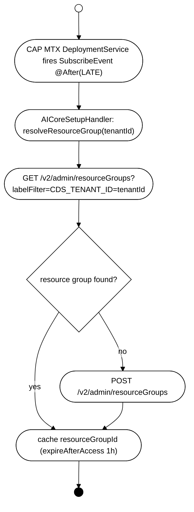
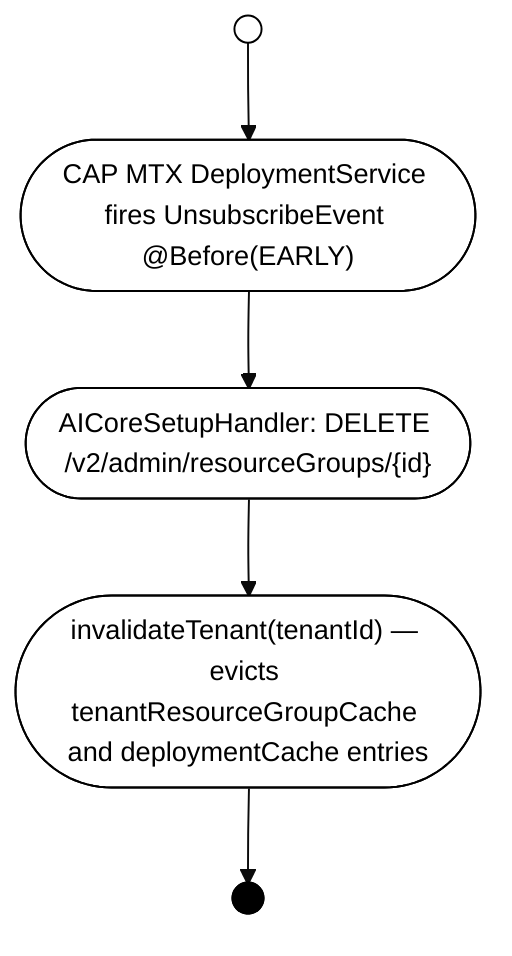

# Architecture: `cds-feature-ai-core`

## Table of Contents

- [Purpose](#purpose)
- [Dependencies](#dependencies)
- [Feature](#feature)
  - [CDS Model](#cds-model)
  - [Public API](#public-api)
  - [Key Infrastructure Classes](#key-infrastructure-classes)
  - [Multi-Tenancy](#multi-tenancy)
  - [Key Flows](#key-flows)
    - [Tenant Subscribe](#tenant-subscribe)
    - [Tenant Unsubscribe](#tenant-unsubscribe)
    - [Inference Client Resolution](#inference-client-resolution)
- [Tests](#tests)
- [Quality Tools](#quality-tools)
- [Architecture Decisions](#architecture-decisions)

---

## Purpose

CAP Java applications need to have to access to AI Core (`com.sap.ai.sdk:ai-core`) to manage resource groups and deployments, and to access an inference client. At the time of writing, AI Core offers no CAP integration — only raw REST API clients. 

This plugin (`‎cds-feature-ai-core`) fills this gap. It bridges CAP Java to SAP AI Core's management and inference REST APIs. It provides resource group management, deployment lifecycle, and inference client resolution as a CAP service. 

→ [README](../README.md)

---

## Dependencies

| Dependency | Why |
|---|---|
| `com.sap.ai.sdk:ai-core` (SAP AI SDK) | Provides the generated `DeploymentApi`, `ConfigurationApi`, `ResourceGroupApi`, and `ApiClient` types used to call the AI Core REST API. The plugin wraps these behind CDS events so callers never deal with the AI SDK directly. |
| `com.github.ben-manes.caffeine:caffeine` | Thread-safe in-process caching for `tenantId → resourceGroupId` and `resourceGroupId::configName → deploymentId` mappings (1 h TTL, 10k max per cache). |
| `io.github.resilience4j:resilience4j-retry` | Exponential backoff (initial 300 ms, doubling, max 30 s, up to 10 attempts) on 403/404/412 responses from AI Core - needed because resource group creation is asyncronous. |
| `com.sap.cds:cds-services-api/-impl/-utils` | CAP Java integration — used to integrate the plugin into the CAP runtime. |
| CAP Java `DeploymentService` | MTX lifecycle hook: `AICoreSetupHandler` subscribes to `SubscribeEvent` (`@After LATE`) and `UnsubscribeEvent` (`@Before EARLY`) to create/delete per-tenant resource groups automatically. |

---

## Feature

### CDS Model

Defined in `src/main/resources/cds/`: `AICore.cds`

```cds
// @protocol: 'none' — programmatic access only, never exposed as OData/REST
service AICore {
  @cds.persistence.skip entity resourceGroups { ... }   // AI Core resource group
  @cds.persistence.skip entity deployments    { ... }   // AI Core deployment + action stop()
  @cds.persistence.skip entity configurations { ... }   // AI Core configuration
}
```

Entities are `@cds.persistence.skip` — they have no database tables and are backed entirely by the AI Core REST API at runtime.

The three custom events are **not declared in the CDS model** — they are Java-only `@EventName`-annotated `EventContext` interfaces in the `api` package:

| Java interface | Event name | In → Out |
|---|---|---|
| `ResourceGroupContext` | `resourceGroup` | `tenantId?` → `resourceGroupId` |
| `DeploymentIdContext` | `deploymentId` | `resourceGroupId + ModelDeploymentSpec` → `deploymentId` |
| `InferenceClientContext` | `inferenceClient` | `resourceGroupId + deploymentId` → `ApiClient` |

---

### Public API

Three custom CDS events are the only stable contract. All other classes are internal.

```java
// Resolve resource group for the current tenant
String rgId = aiCoreService.resourceGroup();

// Resolve (or lazily create) a deployment matching the given model spec
String deploymentId = aiCoreService.deploymentId(rgId, RptModelSpec.rpt1());

// Obtain a pre-configured ApiClient for inference
ApiClient client = aiCoreService.inferenceClient(rgId, deploymentId);
```

See also [Programmatic Usage in README](../README.md#programmatic-usage).

---

### Key Infrastructure Classes

| Class | Role |
|---|---|
| `AICoreServiceConfiguration` | extends `CdsRuntimeConfiguration` — wires all handlers, clients, and caches at startup; detects AI Core binding |
| `AICoreConfig` | Immutable config record populated from `cds.ai.core.*` YAML properties |
| `AICoreClients` | Holds `DeploymentApi`, `ConfigurationApi`, `ResourceGroupApi`, and the raw `AiCoreService` from the AI SDK |
| `DeploymentResolver` | Thread-safe resolver with two Caffeine caches (`tenantId → rgId`, `rgId::configName → deploymentId`) and `ConcurrentHashMap` per-key locks (prevents duplicate deployments under concurrency); Resilience4j backoff on 403/404/412 |
| `AICoreApiHandler` | `@On` handler for the three custom events: `resourceGroup`, `deploymentId`, `inferenceClient` |
| `AICoreSetupHandler` | `@After(LATE) SubscribeEvent` / `@Before(EARLY) UnsubscribeEvent` — creates/deletes resource groups during MTX tenant lifecycle |
| `AbstractCrudHandler` | Base for all entity CRUD handlers; provides `resolveResourceGroup()` and `ensureResourceGroupAccessible()` (tenant isolation guard) |

---

### Multi-Tenancy

→ [Multi-Tenancy in README](../README.md#multi-tenancy)

MT mode is detected automatically at startup: if `cds.multiTenancy.sidecar.url` is set or a `DeploymentService` bean is present in the CAP service catalog, MT mode is active. Resource groups are named `{resourceGroupPrefix}{tenantId}` (default prefix: `cds-`) and labelled `ext.ai.sap.com/CDS_TENANT_ID = <tenantId>` so they can be looked up by tenant.

---

### Key Flows

#### Tenant Subscribe



#### Inference Client Resolution

Every prediction request or inference call requires a fully-configured `ApiClient` that is scoped to a specific AI Core deployment. The challenge is that creating this client requires three sequential steps
— tenant → resource group
- resource group + model spec (e.g. RPT-1) → deployment
- deployment → ApiClient
Each of these involves a remote API call to AI Core (resource groups and deployments are created asynchronously and may not be immediately available). The plugin solves this with per-step Caffeine caches (1 h TTL) to avoid redundant AI Core API calls, `ConcurrentHashMap` per-key locks to prevent duplicate deployment creation under concurrent requests, and Resilience4j exponential backoff to handle the window between a resource group or deployment being created and it becoming usable.

The three steps map directly to the three `EventContext` interfaces and are executed in sequence by `AICoreServiceImpl`:

##### Event 1: resourceGroup

Emitted by any caller (e.g. `cds-feature-recommendations`) via `AICoreService.resourceGroup()` to resolve the AI Core resource group ID for the current tenant. In single-tenant mode, the configured default resource group is returned directly. In multi-tenant mode, `DeploymentResolver` looks up the resource group by the `ext.ai.sap.com/CDS_TENANT_ID` label with a `GET` to `/v2/admin/resourceGroups`. The result is cached for 1 h (expire-after-access) so the AI Core management API is not called on every request. If no resource group is found, it creates one via `POST` to `/v2/admin/resourceGroups` (tolerating 409 conflicts), caches the result, and returns the resource group ID.
Unlike the deployment cache, there is **no validation on cache hits** — if a resource group is deleted externally during that window, the stale ID stays cached and subsequent prediction requests will fail until the entry expires or the app restarts.

##### Event 2: deploymentId — invoked with `resourceGroupId`

Emitted by callers via `AICoreService.deploymentId(rgId, spec)` to resolve (or lazily create) a running deployment matching the given `ModelDeploymentSpec` inside the resource group. `DeploymentResolver` first checks its deployment cache; on a cache miss or invalid cached entry it queries AI Core for an existing RUNNING/PENDING deployment, and — if none exists — creates the configuration and deployment, then polls until RUNNING with exponential backoff: Resilience4j exponential backoff (300 ms initial, doubling, capped at 30 s, max 10 attempts) on: 403/412 during deployment creation (`POST /v2/lm/deployments`); 403/404/412 during deployment polling (`GET /v2/lm/deployments`). A `ConcurrentHashMap` per-key lock prevents duplicate deployments from being created under concurrent first-use requests. The resolved deployment ID is cached for 1 h.


##### Event 3: inferenceClient — invoked with `resourceGroupId` and `deploymentId`

Emitted by callers via `AICoreService.inferenceClient(rgId, deploymentId)` to obtain a pre-configured `ApiClient` ready to make prediction requests against a specific deployment. The handler delegates to the SAP AI SDK's `AiCoreService` to build an inference destination scoped to the resource group and deployment, then wraps it in an `ApiClient`. No caching — the client is lightweight to construct and callers are expected to obtain it once per request.

#### Full flow


#### Tenant Unsubscribe


---

## Tests

Unit tests for `AICoreServiceConfiguration`, `AICoreServiceImpl`, `AICoreSetupHandler`, and the CRUD handlers live in `src/test/` within this module (`mvn test`).

End-to-end integration tests against a real AI Core instance live in [`integration-tests/spring/`](../../integration-tests/README.md) (`AICoreServiceTest`, `DeploymentTest`, `ResourceGroupTest`, `MultiTenancyTest`, and others). MTX lifecycle tests (subscribe/unsubscribe/tenant isolation) live in [`integration-tests/mtx-local/`](../../integration-tests/README.md).

---

## Quality Tools

→ [CI Checks and static analysis](../../CONTRIBUTING.md#ci-checks)

---

## Architecture Decisions

### Wrapping the AI SDK in a CAP service for multi-tenant isolation

**Context:** The SAP AI SDK (`com.sap.ai.sdk:ai-core`) provides API clients with no CAP integration. Plugins like `cds-feature-recommendations` need to resolve a resource group, a deployment, and an inference client on every request — but should not need to know about AI Core internals, tenant routing, or caching.

**Key boundary condition:** The AI SDK's [`DestinationResolver`](https://github.com/SAP/ai-sdk-java/blob/main/core/src/main/java/com/sap/ai/sdk/core/DestinationResolver.java) always connects using `OnBehalfOf.TECHNICAL_USER_PROVIDER` — the provider tenant's service binding. There is no per-subscriber credential mechanism in the SDK. Tenant isolation is the caller's responsibility and is achieved entirely by setting the `AI-Resource-Group` HTTP header on each request to a resource group that belongs to the subscriber tenant. This is a hard constraint imposed by the SDK: any CAP integration on top of it must manage per-tenant resource group resolution itself — there is no way to "just pass a tenant ID" to the SDK and have it route correctly.
Beyond billing, proper per-tenant resource groups are also important for call history separation in AI Core: without them, all tenants' inference calls would appear under the same resource group in the AI Core audit log.

**Decision:** Expose the three resolution steps (`resourceGroup`, `deploymentId`, `inferenceClient`) as custom CDS events on the `AICore` service. The `resourceGroup` event resolves the correct per-tenant resource group ID from the current CAP request context (`UserInfo.getTenant()`), which is then threaded through to `deploymentId` and `inferenceClient`. Every AI Core call made by `AICoreApiHandler` carries this resource group ID as the `AI-Resource-Group` header, satisfying the SDK's constraint.
Callers invoke the `AICoreService` Java API (`resourceGroup()`, `deploymentId()`, `inferenceClient()`), which emits the corresponding CDS events; `AICoreApiHandler` handles them. This keeps the AI SDK entirely internal and gives application code a standard `@On`/`@After` handler hook to override or observe each step if needed.

---

### Caching resource group ids and deployment ids

**Context:** Resolving an inference-ready `ApiClient` requires three sequential remote calls to AI Core (resource group lookup, deployment lookup/creation, client construction). AI Core deployments may not exist yet on first use and take minutes to reach RUNNING state. Calling the management API on every OData read would be prohibitively slow.

**Solutions considered:**
- **`TenantAwareCache` (CAP built-in)** — `com.sap.cds.services.utils.TenantAwareCache` provides tenant-scoped invalidation natively and is already on the classpath via `cds-services-utils`. Not used yet but a candidate to replace the current manual Caffeine caches; see [#129](https://github.com/cap-java/cds-ai/issues/129).
 - **In-process Caffeine cache per step** — zero additional infrastructure, thread-safe, configurable TTL. Accepted: the worst case (cache miss on restart or TTL expiry) is a single slow request; subsequent requests are fast.

**Decision:** Cache `tenantId → resourceGroupId` and `resourceGroupId::configName → deploymentId` in two separate Caffeine caches with 1 h expire-after-access TTL. The deployment cache entry is validated on each cache hit (a `GET` to verify RUNNING/PENDING status) to detect externally stopped deployments. The resource group cache has no hit-validation — a stale entry causes failures until the TTL expires; this was accepted as an acceptable trade-off given that resource groups are rarely deleted externally.

---

### Preventing duplicate AI deployments

**Context:** Multiple requests may arrive concurrently before any deployment exists (e.g. on cold start of a new tenant). Without coordination, each request would independently discover the absence of a deployment and try to create one, resulting in duplicate deployments.

**Decision:** Use a `ConcurrentHashMap<String, Object>` as a lock registry, synchronized on the value for the specific key being resolved. Only the first thread for a given key enters `findOrCreateDeployment`; subsequent threads wait and then find the deployment already in the cache.

---

### Resilience4j exponential backoff for asynchronous AI Core operations

**Context:** AI Core resource group and deployment creation is asynchronous. After a `POST /v2/admin/resourceGroups` or `POST /v2/lm/deployments`, subsequent calls may return 403 or 412 (precondition failed) until the resource is fully provisioned. Polling is necessary to wait for a deployment to reach RUNNING status.

**Decision:** Use Resilience4j retry with exponential backoff (300 ms initial delay, doubling each attempt, capped at 30 s, max 10 attempts) on 403/404/412 responses from: `POST /v2/lm/deployments` (creation) and `GET /v2/lm/deployments/{id}` (polling until RUNNING). The same retry strategy covers both the "resource not yet available" and "deployment not yet running" cases.
