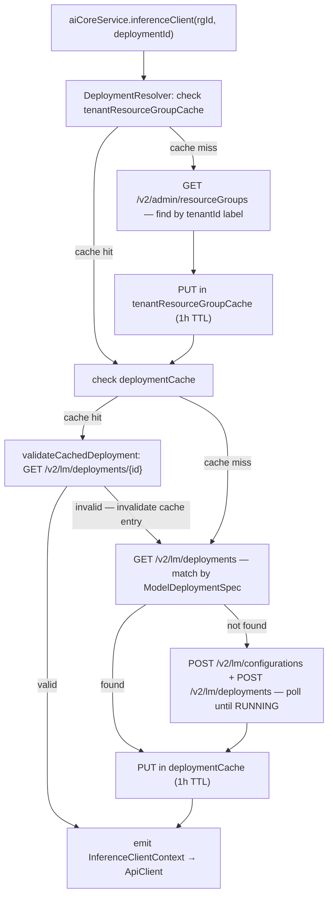

# Architecture: `cds-feature-ai-core`

## Table of Contents

- [Purpose](#purpose)
- [Dependencies](#dependencies)
- [Feature](#feature)
  - [CDS Model](#cds-model)
  - [Public API](#public-api)
  - [Key Infrastructure Classes](#key-infrastructure-classes)
  - [Multi-Tenancy](#multi-tenancy)
  - [Key Flows](#key-flows)
    - [Tenant Subscribe](#tenant-subscribe)
    - [Tenant Unsubscribe](#tenant-unsubscribe)
    - [Inference Client Resolution](#inference-client-resolution)
- [Tests](#tests)
- [Quality Tools](#quality-tools)

---

## Purpose

Bridges CAP Java to SAP AI Core's management and inference REST APIs, providing resource group management, deployment lifecycle, and inference client resolution as a standard CAP `RemoteService`. At the time of writing, `com.sap.ai.sdk:ai-core` offered no CAP integration — only raw REST API clients — so this plugin fills that gap.

→ [README](../README.md)

---

## Dependencies

| Dependency | Why |
|---|---|
| `com.sap.ai.sdk:ai-core` (SAP AI SDK) | Provides the generated `DeploymentApi`, `ConfigurationApi`, `ResourceGroupApi`, and `ApiClient` types used to call the AI Core REST API. The plugin wraps these behind CDS events so callers never deal with the SDK directly. |
| `com.github.ben-manes.caffeine:caffeine` | Thread-safe in-process caching for `tenantId → resourceGroupId` and `resourceGroupId::configName → deploymentId` mappings (1 h TTL, 10k max per cache). |
| `io.github.resilience4j:resilience4j-retry` | Exponential backoff (initial 300 ms, doubling, max 30 s, up to 10 attempts) on 403/404/412 responses from AI Core - needed because resource group creation is asyncronous. |
| CAP Java `DeploymentService` | MTX lifecycle hook: `AICoreSetupHandler` subscribes to `SubscribeEvent` (`@After LATE`) and `UnsubscribeEvent` (`@Before EARLY`) to create/delete per-tenant resource groups automatically. |

---

## Feature

### CDS Model

Defined in `src/main/resources/cds/`: `AICore.cds`

```cds
// @protocol: 'none' — programmatic access only, never exposed as OData/REST
service AICore {
  @cds.persistence.skip entity resourceGroups { ... }   // AI Core resource group
  @cds.persistence.skip entity deployments    { ... }   // AI Core deployment + action stop()
  @cds.persistence.skip entity configurations { ... }   // AI Core configuration

  // Events:
  event resourceGroup    // in: (optional: tenantId — falls back to UserInfo.getTenant() from request context)  → out: resourceGroupId
  event deploymentId     // in: resourceGroupId + ModelDeploymentSpec → out: deploymentId
  event inferenceClient  // in: resourceGroupId + deploymentId → out: ApiClient
}
```

Entities are `@cds.persistence.skip` — they have no database tables and are backed entirely by the AI Core REST API at runtime.

---

### Public API

→ [Programmatic Usage in README](../README.md#programmatic-usage)

---

### Key Infrastructure Classes

| Class | Role |
|---|---|
| `AICoreServiceConfiguration` | extends `CdsRuntimeConfiguration` — wires all handlers, clients, and caches at startup; detects AI Core binding |
| `AICoreConfig` | Immutable config record populated from `cds.ai.core.*` YAML properties |
| `AICoreClients` | Holds `DeploymentApi`, `ConfigurationApi`, `ResourceGroupApi`, and the raw `AiCoreService` from the AI SDK |
| `DeploymentResolver` | Thread-safe resolver with two Caffeine caches (`tenantId → rgId`, `rgId::configName → deploymentId`) and `ConcurrentHashMap` per-key locks (prevents duplicate deployments under concurrency); Resilience4j backoff on 403/404/412 |
| `AICoreApiHandler` | `@On` handler for the three custom events: `resourceGroup`, `deploymentId`, `inferenceClient` |
| `AICoreSetupHandler` | `@After(LATE) SubscribeEvent` / `@Before(EARLY) UnsubscribeEvent` — creates/deletes resource groups during MTX tenant lifecycle |
| `AbstractCrudHandler` | Base for all entity CRUD handlers; provides `resolveResourceGroup()` and `ensureResourceGroupAccessible()` (tenant isolation guard) |

---

### Multi-Tenancy

→ [Multi-Tenancy in README](../README.md#multi-tenancy)

---

### Key Flows

#### Tenant Subscribe

```
CAP MTX DeploymentService
        |
        | SubscribeEvent @After(LATE)
        v
AICoreSetupHandler
        |
        | resolveResourceGroup(tenantId)
        v
DeploymentResolver
        |
        | GET /v2/admin/resourceGroups?labelFilter=CDS_TENANT_ID=tenantId
        v
SAP AI Core
        |
        | (if absent) POST /v2/admin/resourceGroups
        v
resourceGroupId (cached 1h after last access — subsequent calls skip the AI Core management API;
                  if a resource group is deleted or reassigned externally, the plugin won't notice until the cache expires after 1h or the app restarts)
```

#### Inference Client Resolution


*Resilience4j exponential backoff (300 ms initial, doubling, capped at 30 s, max 10 attempts) on: 403/412 during deployment creation (`POST /v2/lm/deployments`); 403/404/412 during deployment polling (`GET /v2/lm/deployments`).*


#### Tenant Unsubscribe

```
CAP MTX DeploymentService
        |
        | UnsubscribeEvent @Before(EARLY)
        v
AICoreSetupHandler
        |
        | DELETE /v2/admin/resourceGroups/{id}
        v
SAP AI Core
        |
        | invalidateTenant(tenantId) — evicts tenantResourceGroupCache and deploymentCache (which was filled on first call to resolveDeployment) entries for this tenant
        v
(done)
```
---

## Tests

Unit tests for `AICoreServiceConfiguration`, `AICoreServiceImpl`, `AICoreSetupHandler`, and the CRUD handlers live in `src/test/` within this module (`mvn test`).

End-to-end integration tests against a real AI Core instance live in [`integration-tests/spring/`](../../integration-tests/README.md) (`AICoreServiceTest`, `DeploymentTest`, `ResourceGroupTest`, `MultiTenancyTest`, and others). MTX lifecycle tests (subscribe/unsubscribe/tenant isolation) live in [`integration-tests/mtx-local/`](../../integration-tests/README.md).

---

## Quality Tools

→ [CI Checks and static analysis of outer module](../../README.md#ci-checks)
