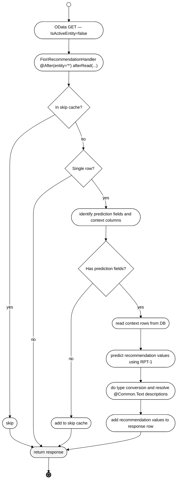
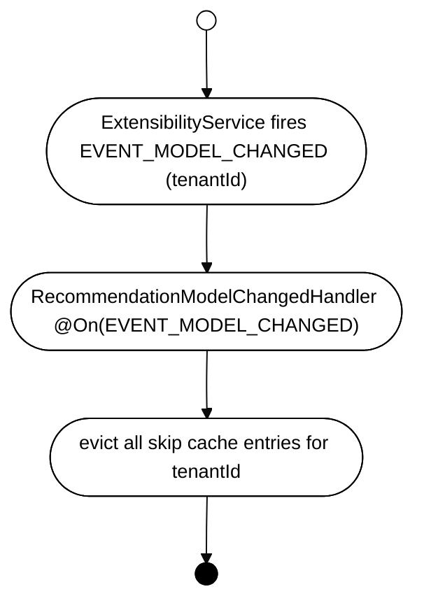

# Architecture: `cds-feature-recommendations`

## Table of Contents

- [Purpose](#purpose)
- [Dependencies](#dependencies)
- [Feature](#feature)
  - [CDS Model](#cds-model)
  - [Configuration](#configuration)
  - [Public API / Handlers](#public-api--handlers)
  - [Key Infrastructure Classes](#key-infrastructure-classes)
  - [Multi-Tenancy](#multi-tenancy)
  - [Key Flows](#key-flows)
    - [Recommendation Pipeline (OData GET on draft entity)](#recommendation-pipeline-odata-get-on-draft-entity)
    - [Context row selection](#context-row-selection)
    - [MTX Model Change — Cache Invalidation](#mtx-model-change--cache-invalidation)
- [Tests](#tests)
- [Quality Tools](#quality-tools)
- [Architecture Decisions](#architecture-decisions)

---

## Purpose

This plugin (`cds-feature-recommendations`) automatically injects AI-powered field recommendations from the [SAP-RPT-1](https://help.sap.com/docs/sap-ai-core/generative-ai/sap-rpt-1) tabular prediction foundation model into Fiori Elements OData responses for draft-enabled entities. Zero application code required.

→ [README](../README.md)

---

## Dependencies

| Dependency | Why |
|---|---|
| [`cds-feature-ai-core`](../../cds-feature-ai-core/README.md) | Provides the `AICore` CDS service and `AICoreService` API used to resolve the resource group, deployment ID, and inference `ApiClient` for the RPT-1 model. Recommendations cannot function without an active AI Core connection. |
| `@cap-js/ai` (Node.js CDS plugin) | At CDS build time, the plugin adds the `SAP_Recommendations` navigation property to draft-enabled entities that have value-list fields. Without this (or a manual CDS extension), predictions are computed but not serialized in OData responses. |
| `com.sap.ai.sdk.foundationmodels:sap-rpt` (SAP AI SDK) | Provides the RPT-1 model client used to call the `/predict` endpoint. |
| `com.github.ben-manes.caffeine:caffeine` | Thread-safe in-process caching for the per-tenant entity skip cache (10k max, no TTL). This might be replaced in [#129](https://github.com/cap-java/cds-ai/issues/129).|
| `com.sap.cds:cds-services-api/-impl/-utils` | CAP Java integration — used to integrate the plugin into the CAP runtime. |

---

## Feature

### CDS Model

No dedicated CDS model file — the plugin relies on the `AICore` service model provided by `cds-feature-ai-core`, and on the `SAP_Recommendations` navigation property injected by the `@cap-js/ai` Node.js plugin (or added manually by the application).

The Node plugin will automatically detect fields annotated with a value list, i.e., fields annotated with `@Common.ValueList`, `@Common.ValueListWithFixedValues`, or whose association target has `@cds.odata.valuelist`, also see [`README`](../README.md#enabling-recommendations).

### Configuration

Wired by `RecommendationConfiguration` (extends `CdsRuntimeConfiguration`) at startup. It detects whether an AI Core binding is present and selects production vs. mock mode accordingly — no manual activation is required.

### Public API / Handlers

No Java API — the plugin is entirely annotation-driven. Extend or annotate your CDS model to control which fields receive recommendations, see [`README`](../README.md#enabling-recommendations).
Currently, it is not possible to hook into the recommendation result from application code to observe the injected output, nor to override the inference call itself ([#110](https://github.com/cap-java/cds-ai/issues/110)).

### Key Infrastructure Classes

| Class | Role |
|---|---|
| `RecommendationConfiguration` | extends `CdsRuntimeConfiguration` — wires all handlers at startup; selects production vs. mock based on AI Core binding presence |
| `FioriRecommendationHandler` | `@After` read handler on all app services (`entity="*"`) — cross-cutting read interceptor; orchestrates the full recommendation pipeline |
| `RecommendationContextBuilder` | Reads CDS annotations to determine which fields are prediction targets and which columns supply training context |
| `RptModelSpec` | Static factory for the `ModelDeploymentSpec` targeting `sap-rpt-1-small`; used as the cache key for deployment resolution |
| `RptInferenceClient` | Calls RPT-1 `/predict` endpoint; handles the synthetic `SAP_RECOMMENDATIONS_ID` index column for composite/non-string keys |
| `RecommendationResultParser` | Type-coerces RPT-1 string output back to CDS primitive types; resolves `@Common.Text` descriptions from the database |
| `RecommendationModelChangedHandler` | `@On(EVENT_MODEL_CHANGED)` — invalidates per-tenant entity cache on MTX model upgrade |

### Multi-Tenancy

→ [Multi-Tenancy in cds-feature-ai-core README](../../cds-feature-ai-core/README.md#multi-tenancy)

Tenant isolation is inherited from `cds-feature-ai-core`: each prediction call resolves the resource group and deployment for the current request's tenant. No additional MT configuration is required in this module.

**Per-tenant entity cache** (in `FioriRecommendationHandler`):

```
Cache<"<tenantId>:<entityName>", Boolean>   10k max, no TTL
  → entities with no prediction columns are recorded and skipped on every future read
  → invalidated by RecommendationModelChangedHandler on model change
```

The cache is keyed by `<tenantId>:<entityName>` and is invalidated on `ExtensibilityService.EVENT_MODEL_CHANGED` — ensuring that model upgrades (which may add or remove value-list annotations) are reflected without a restart, see also [MTX Model Change — Cache Invalidation](#mtx-model-change--cache-invalidation). This cache might be replaced with [#129](https://github.com/cap-java/cds-ai/issues/129).

Currently the cache stores only **misses** — entities that have no prediction columns. For entities that *do* have prediction columns, `RecommendationContextBuilder` re-derives them from the CDS model on every request. An alternative design would cache `Set<String>` (the prediction column names) instead of `Boolean`, using an empty set for the no-prediction case. This would eliminate the per-request model scan for all entities, at the cost of a slightly larger cache value.

### Key Flows

#### Recommendation Pipeline (OData GET on draft entity)



##### Context row selection

Context rows are fetched via `RecommendationContextBuilder.buildContextQuery()` directly against the `PersistenceService` (bypassing the application service layer — see [authorization note](#context-rows-and-instance-based-authorization) below). The query selects all non-draft, non-computed, non-readonly scalar columns of the same entity, filtered to rows where **all prediction columns are non-null** — rows that already have values for the fields being predicted. The current row is implicitly excluded because it still has null prediction values. Results are ordered by the most-recently-updated column (`@cds.on.update`) descending, or by key as fallback, and capped at `cds.ai.recommendations.contextRowLimit` (default 2000).

This means selection is **recency-based, not similarity-based**: the model receives the most recently modified existing records as training context, not records that are semantically "near" the row being predicted.

Context rows are **not cached** — every prediction fires a fresh database query.

Context rows are currently fetched via `PersistenceService` (direct DB access), bypassing the application service and any instance-based authorization checks. This means a user could receive recommendations trained on rows they would not be allowed to read through the application service.
See: [#128](https://github.com/cap-java/cds-ai/issues/128).

#### MTX Model Change — Cache Invalidation



---

## Tests

Unit tests for `FioriRecommendationHandler`, `RptInferenceClient`, and `RecommendationConfiguration` live in `src/test/` within this module (`mvn test`).

End-to-end integration tests covering the full recommendation pipeline against a real AI Core instance live in [`integration-tests/`](../../integration-tests/README.md) in the outer module (`RecommendationTest`, `NonStandardKeyRecommendationTest`).

---

## Quality Tools

→ [CI Checks and static analysis](../../CONTRIBUTING.md#ci-checks)

---

## Architecture Decisions

### Annotation-driven activation

**Context:** Recommendations need to work across any CAP application that has value-list fields on draft-enabled entities, without requiring application developers to write handler code or configure anything beyond the CDS model annotations that are already required for Fiori value help.

**Decision:** Annotation-driven activation. `FioriRecommendationHandler` registers as an `@After(entity="*")` handler on all application services and derives prediction targets from the CDS model on each request. The `@cap-js/ai` Node.js CDS plugin adds the `SAP_Recommendations` navigation property to the model at build time so the predictions are serialized in the OData response without application changes. The trade-off is less flexibility — application code cannot currently override the inference call or observe the raw prediction result — tracked in [#110](https://github.com/cap-java/cds-ai/issues/110).

---

### Recency-based context row selection

**Context:** RPT-1 is a tabular prediction model that learns patterns from example rows (context rows) provided alongside the row to predict. The quality of predictions depends on the relevance of the context. Fetching all rows is impractical for large tables, and most models als impose a limit on the context rows (e.g. 2048 for SAP-RPT-1 https://help.sap.com/docs/sap-ai-core/generative-ai/sap-rpt-1#sap-rpt-models).

**Solutions considered:**
- **Similarity-based selection** — select rows most semantically similar to the current row (e.g. by embedding distance or matching field values). This would select a better training context but requires additional infrastructure and adds much more complexity.
- **Recency-based selection (most recently modified first)** — orders by `@cds.on.update` descending, capped at `cds.ai.recommendations.contextRowLimit` (default 2000). Favors the most up-to-date data and requires no additional infrastructure.
**Decision:** Recency-based selection. The assumption is that recent records reflect the current state of the data better than older ones, making them more representative training context for the current user's editing patterns. Similarity-based selection remains a possible future improvement ([#128](https://github.com/cap-java/cds-ai/issues/128)) but was rejected for the initial version due to infrastructure requirements.

---

### Miss-only entity skip cache

**Context:** `RecommendationContextBuilder` derives prediction columns by scanning the CDS model on every request. For entities with no value-list fields, this scan is repeated on every OData GET — wasteful, since the model only changes on MTX upgrades.

**Solutions considered:**
- **No cache** — simple but scans the model on every request for every entity, including those that will never have predictions.
- **Cache misses only (`Boolean` flag)** — entities with no prediction columns are cached; entities with columns are re-scanned every request. Small cache, but doesn't help for the common case of entities that do have predictions.
- **Cache the prediction column set (`Set<String>`)** — cache the derived column names for all entities, using an empty set for no-prediction entities. Eliminates the per-request model scan entirely; slightly larger cache values.

**Decision:** Cache misses only for now (`Cache<String, Boolean>`). The per-request model scan for entities that *do* have predictions was accepted as acceptable overhead in the initial version. Caching `Set<String>` instead is tracked as a follow-up in [#129](https://github.com/cap-java/cds-ai/issues/129). The cache is keyed by `<tenantId>:<entityName>` and invalidated on `EVENT_MODEL_CHANGED` so MTX model upgrades are reflected without a restart.
