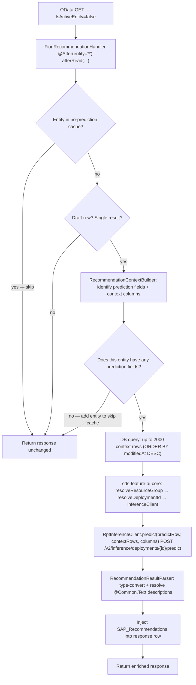

# Architecture: `cds-feature-recommendations`

## Table of Contents

- [Purpose](#purpose)
- [Dependencies](#dependencies)
- [Feature](#feature)
  - [CDS Model](#cds-model)
  - [Configuration](#configuration)
  - [Public API / Handlers](#public-api--handlers)
  - [Key Infrastructure Classes](#key-infrastructure-classes)
  - [Multi-Tenancy](#multi-tenancy)
  - [Key Flows](#key-flows)
    - [Recommendation Pipeline (OData GET on draft entity)](#recommendation-pipeline-odata-get-on-draft-entity)
    - [MTX Model Change — Cache Invalidation](#mtx-model-change--cache-invalidation)
- [Tests](#tests)
- [Quality Tools](#quality-tools)

---

## Purpose

Automatically injects AI-powered field recommendations from the SAP RPT-1 tabular prediction foundation model into Fiori Elements OData responses for draft-enabled entities. Zero application code required.

→ [README](../README.md)

---

## Dependencies

| Dependency | Why |
|---|---|
| [`cds-feature-ai-core`](../../cds-feature-ai-core/README.md) | Provides the `AICore` CDS service and `AICoreService` API used to resolve the resource group, deployment ID, and inference `ApiClient` for the RPT-1 model. Recommendations cannot function without an active AI Core connection. |
| `@cap-js/ai` (Node.js CDS plugin) | At CDS build time, the plugin adds the `SAP_Recommendations` navigation property to draft-enabled entities that have value-list fields. Without this (or a manual CDS extension), predictions are computed but not serialized in OData responses. |
| `com.sap.ai.sdk.foundationmodels:sap-rpt` (SAP AI SDK) | Provides the RPT-1 model client used to call the `/predict` endpoint. |
| `com.github.ben-manes.caffeine:caffeine` | Thread-safe in-process caching for the per-tenant entity skip cache (10k max, no TTL). |
| `com.sap.cds:cds-services-api/-impl/-utils` | CAP Java integration — used to integrate the plugin into the CAP runtime. |

---

## Feature

### CDS Model

No dedicated CDS model file — the plugin relies on the `AICore` service model provided by `cds-feature-ai-core`, and on the `SAP_Recommendations` navigation property injected by the `@cap-js/ai` Node.js plugin (or added manually by the application).

The Node plugin will automatically detect fields annotated with a value list, see [`README`](../README.md#enabling-recommendations).

### Configuration

Wired by `RecommendationConfiguration` (extends `CdsRuntimeConfiguration`) at startup. It detects whether an AI Core binding is present and selects production vs. mock mode accordingly — no manual activation is required.

### Public API / Handlers

No Java API — the plugin is entirely annotation-driven. Extend or annotate your CDS model to control which fields receive recommendations, see [`README`](../README.md#enabling-recommendations).
Currently, it is not possible to hook into the recommendation result from application code to observe the injected output, nor to override the inference call itself ([#110](https://github.com/cap-java/cds-ai/issues/110)).

### Key Infrastructure Classes

| Class | Role |
|---|---|
| `RecommendationConfiguration` | extends `CdsRuntimeConfiguration` — wires all handlers at startup; selects production vs. mock based on AI Core binding presence |
| `FioriRecommendationHandler` | `@After` read handler on all app services (`entity="*"`) — cross-cutting read interceptor; orchestrates the full recommendation pipeline |
| `RecommendationContextBuilder` | Reads CDS annotations to determine which fields are prediction targets and which columns supply training context |
| `RptModelSpec` | Static factory for the `ModelDeploymentSpec` targeting `sap-rpt-1-small`; used as the cache key for deployment resolution |
| `RptInferenceClient` | Calls RPT-1 `/predict` endpoint; handles the synthetic `SAP_RECOMMENDATIONS_ID` index column for composite/non-string keys |
| `RecommendationResultParser` | Type-coerces RPT-1 string output back to CDS primitive types; resolves `@Common.Text` descriptions from the database |
| `RecommendationModelChangedHandler` | `@On(EVENT_MODEL_CHANGED)` — invalidates per-tenant entity cache on MTX model upgrade |

### Multi-Tenancy

→ [Multi-Tenancy in cds-feature-ai-core README](../../cds-feature-ai-core/README.md#multi-tenancy)

Tenant isolation is inherited from `cds-feature-ai-core`: each prediction call resolves the resource group and deployment for the current request's tenant. No additional MT configuration is required in this module.

**Per-tenant entity cache** (in `FioriRecommendationHandler`):

```
Cache<"<tenantId>:<entityName>", Boolean>   10k max, no TTL
  → entities with no prediction columns are recorded and skipped on every future read
  → invalidated by RecommendationModelChangedHandler on model change
```

### Key Flows

#### Recommendation Pipeline (OData GET on draft entity)



#### No-prediction-cache Invalidation

```
ExtensibilityService
        |
        | EVENT_MODEL_CHANGED (tenantId)
        v
RecommendationModelChangedHandler
        |
        | evict all entries in no-prediction-cache for tenantId
        v
Next read re-evaluates
```

---

## Tests

Unit tests for `FioriRecommendationHandler`, `RptInferenceClient`, and `RecommendationConfiguration` live in `src/test/` within this module (`mvn test`).

End-to-end integration tests covering the full recommendation pipeline against a real AI Core instance live in [`integration-tests/`](../../integration-tests/README.md) in the outer module (`RecommendationTest`, `NonStandardKeyRecommendationTest`).

---

## Quality Tools

→ [CI Checks and static analysis of outer module](../../README.md#ci-checks)
